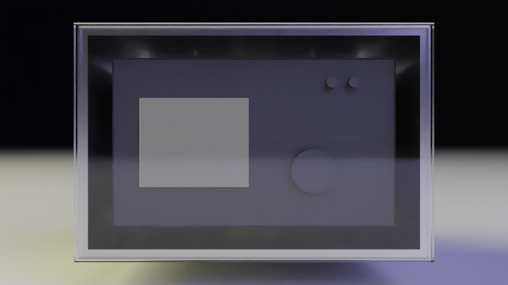

# open water housing 

opensource underwater housing platform

Concept rendering.

## Design goal
The goal of this project is to create an opensource camera housing for higher end cameras that is more reusable than off the shelf custom camera housings designed for a specific camera. 

The housing is designed to expose only limited essential functionality such as power on / off and shutter. 

## Disadvantage
The disadvantage of having a 

## Dimensions of common cameras

| Camera      | Width | Length  |  Height |
| ----------- | ----------- | ----------- | ----------- 
| Sony A7 IV  | 131 | 96 | 80
| Sony FX3  | 129.7 | 84.5 | 77.8
| Sony A7S III   | 128.9   | 96.9 | 69.7
| Canon R5   | 138   | 97.5 | 88
| Canon R5   | 138   | 97.5 | 88.4

## Extruded Rectangle Tube
Would it be possible to use an off the shelf piece of Aluminum Rectangle Tube (Extruded) as the camera body? 

| Inches      | MM 
| ----------- | ----------- |
| 0.25 | 6.35
| 3 | 76.2
| 4 | 101.6
| 5 | 127
| 6 | 152.4

Based on the above conversions - it seems a 4x6 inch would fit any of the above cameras with room to spare...  What would it look like?

It's a bit ugly but it fits snugly. The following rendering is using Sony FX3 to modeled to scale. The buttons and dials are not modeled accurately but the exterior dimensions are accurate which is what matters. The housing dimensions would be:

Width: 152.4 - (6.35 x 2) =  139.3
Height: 101.6 - (6.35 x 2) =  88.9

The above calculations assume 0.25 (1/4 inch) thickness walls. 

For the sony cameras there is more margin - some 3D printed spacers could be added to secure it snugly inside the housing. For the Canon cameras it's a tighter fit but technically it fits?

The long flat walls would be stress points at deeper depths - some sort of reenforcement stiffeners could be welded along the outside to reenforce the walls if needed. 

Is this the best solution? I don't know... 

## Lens Port

There are many commercially availible lens ports that are proven and tested. The front plate could be customized to fit commercially availible lens ports. 

## Buttons

Different types of buttons could be used:
- Buttons could be O-ring seal (most commonly used with commercial products)
- Magnetic switch (need to explore more)
- Bluetooth On / Off remote (would make waterproofing more and secure

## Handles

Todo

