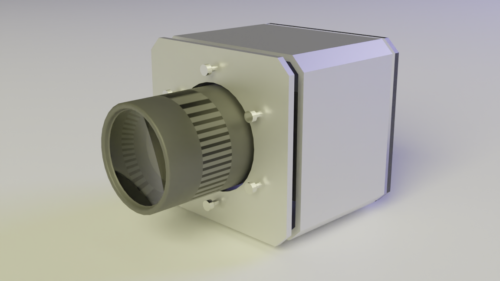
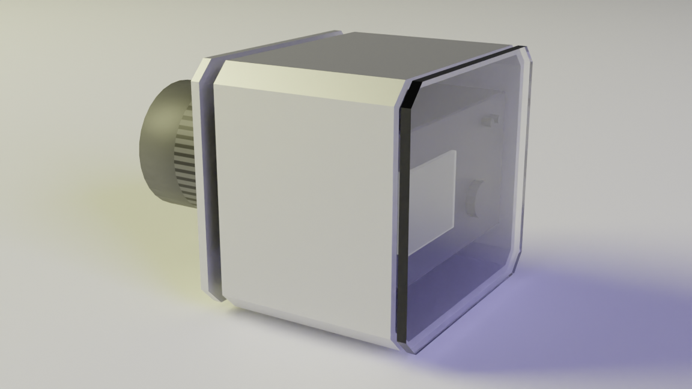

# openhousing 

opensource underwater housing platform

## Design goal
The goal of this project is to create an opensource camera housing for higher end cameras that is more reusable than off the shelf custom camera housings designed for a specific camera. 

## Dimensions of common cameras

| Camera      | Width | Length  |  Height |
| ----------- | ----------- | ----------- | ----------- 
| Sony A7 IV  | 131 | 96 | 80
| Sony FX3  | 129.7 | 84.5 | 77.8
| Sony A7S III   | 128.9   | 96.9 | 69.7
| Canon R5   | 138   | 97.5 | 88
| Canon R5   | 138   | 97.5 | 88.4
